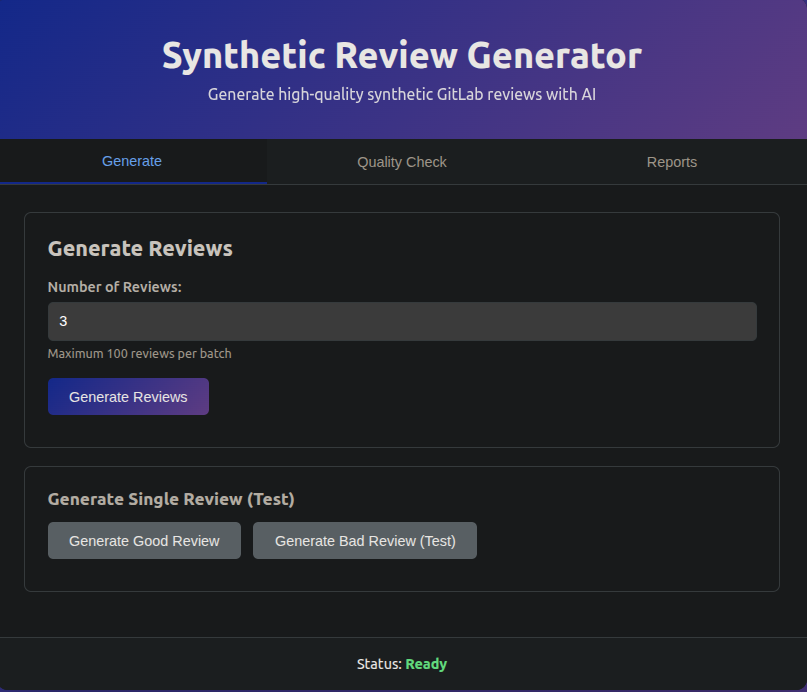
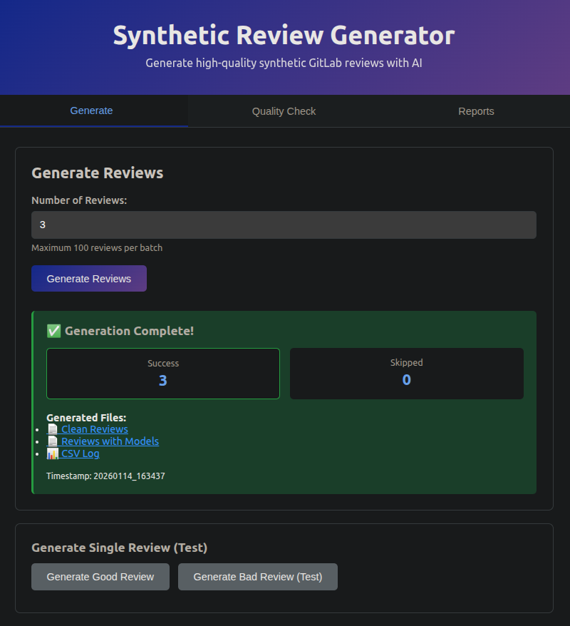
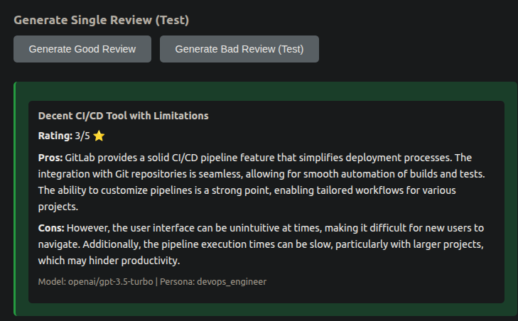
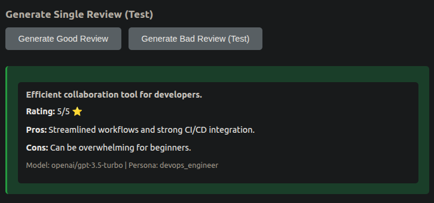
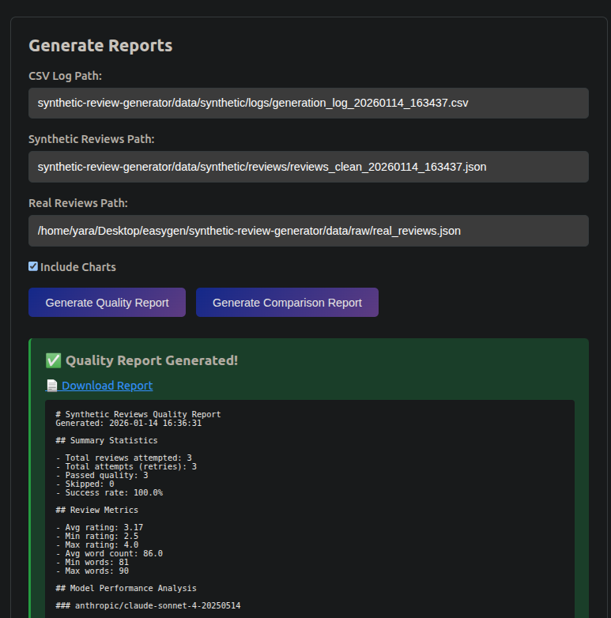
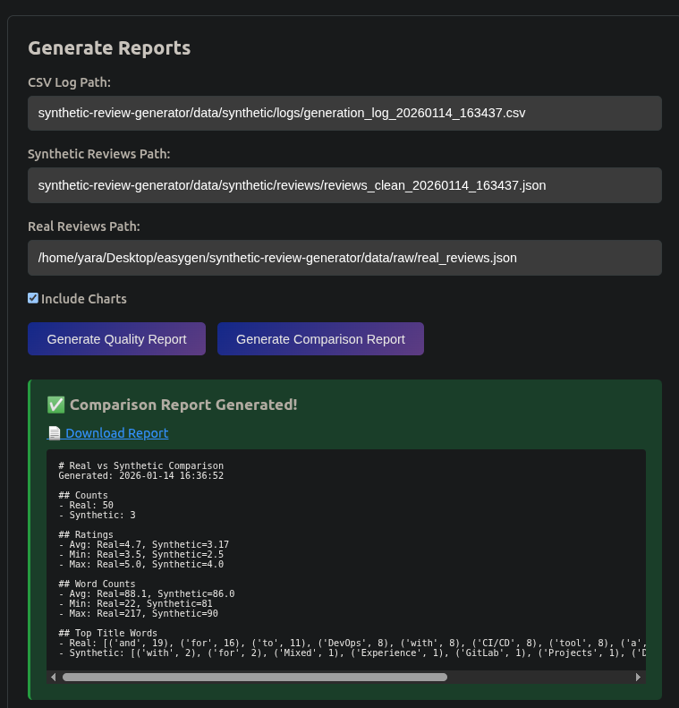

# Synthetic Review Generator



## Project Overview

Build a synthetic data generator for GitLab reviews with quality guardrails. Generate 500 synthetic reviews using multiple LLM providers and validate them against 50 real reviews from G2.

---

## Setup & Installation

### 1. Clone the Repository
```bash
git clone https://github.com/yaranasser/synthetic-review-generator.git
cd synthetic-review-generator
```

### 2. Create a Python Virtual Environment
```bash
python3 -m venv venv
```

### 3. Activate the Virtual Environment

**Linux/macOS:**
```bash
source venv/bin/activate
```

**Windows (cmd):**
```cmd
venv\Scripts\activate
```

**Windows (PowerShell):**
```powershell
.\venv\Scripts\Activate.ps1
```

### 4. Install Requirements
```bash
pip install --upgrade pip
pip install -r requirements.txt
```

### 5. Environment Variables

Create a `.env` file in the project root and add your API keys:
```bash
OPENAI_API_KEY="your_openai_key"
ANTHROPIC_API_KEY="your_anthropic_key"
```

### 6. Output Structure
```
data/
├── raw/
│   └── real_reviews.json
└── synthetic/
    ├── logs/
    │   └── generation_log_TIMESTAMP.csv
    ├── reviews/
    │   └── reviews_clean_TIMESTAMP.json
    └── reviews_models/
        └── reviews_with_models_TIMESTAMP.json

reports/
├── charts/
│   ├── rating_distribution.png
│   ├── word_count_distribution.png
│   └── ...
├── quality_report_TIMESTAMP.md
└── comparison_TIMESTAMP.md
```

---

## Usage

### Option 1: Web UI (Flask API)

The easiest way to use the generator is through the web interface.

#### Start the Flask Server
```bash
python app.py
```

The server will start on `http://localhost:4000`

#### Access the Web Interface

Open your browser and navigate to:
```
http://localhost:4000
```

#### Web UI Features

- **Generate Tab**: Generate single or batch reviews with quality checks
- **Quality Check Tab**: Test review quality with custom inputs
- **Reports Tab**: Auto-generate quality and comparison reports
- **Files Tab**: Browse and download all generated files

## Screenshots

<table>
  <tr>
    <td><br/><b>Batch Generation</b></td>
    <td><br/><b>Good Review Test</b></td>
  </tr>
  <tr>
    <td><br/><b>Bad Review Test</b></td>
    <td><br/><b>Quality Report</b></td>
  </tr>
  <tr>
    <td colspan="2" align="center"><br/><b>Comparison Report</b></td>
  </tr>
</table>

---

### Option 2: Command Line

Generate reviews directly from the command line:
```bash
# Generate 50 reviews
python src/generator.py --count 50

# Generate 400 reviews
python src/generator.py --count 400
```

#### Output Files

Generated files are saved in:
- `data/synthetic/reviews/` - Clean JSON reviews
- `data/synthetic/reviews_models/` - Reviews with model info
- `data/synthetic/logs/` - CSV generation logs
- `reports/` - Quality and comparison reports

---

## Development Phases

### Phase 1: [Data Collection](synthetic-review-generator/data/raw)
- Collected 50 real reviews from G2 as CSV
- Converted to JSON format with rating, title, pros, cons

### Phase 2: [Basic Generation (No Quality Checks)](synthetic-review-generator/src/basic_generator.py)
- Built core generator with OpenAI and Anthropic APIs
- Implemented persona-based prompts
- Generated initial reviews to test API integration

### Phase 3: [Quality Metrics Implementation](synthetic-review-generator/src/quality)
- Built length validation
- Implemented diversity checks (Jaccard similarity)
- Added semantic similarity (TF-IDF)
- Implemented bias detection (TextBlob)
- Added domain realism check (LLM-as-judge)

### Phase 4: [Generation with Quality Checks](synthetic-review-generator/src/generator.py)
- Integrated quality checker into generation pipeline
- Added auto-retry logic (max 3 attempts)
- Implemented CSV logging for all attempts
- Added 10% bad prompts to test retry system

### Phase 5: [Reports](synthetic-review-generator/src/reports.py) and [CLI](synthetic-review-generator/src/cli.py)
- Built comparison report (real vs synthetic)
- Built quality report from CSV logs
- Created unified CLI with subcommands

### Phase 6: [Flask API & Web UI](synthetic-review-generator/app.py)
- Built REST API with Flask
- Created interactive web interface
- Implemented auto-file detection for reports
- Added file browser and download functionality
- Real-time quality checking through UI

---

## Part 1: Data Collection

**Method:** Manual CSV export from G2

**Data Source:**[G2](https://www.g2.com/products/gitlab/reviews)

**Output:** 50 real GitLab reviews in JSON format

**Data Structure:**
```json
{
  "rating": 5.0,
  "review_text": "Combined title, pros, and cons",
  "title": "Review title",
  "pros": "Positive aspects",
  "cons": "Negative aspects"
}
```

---

## Part 2: Data Generator

### Method: Direct LLM API Calls

**Models:**
- OpenAI: gpt-4o-mini (50%)
- Anthropic: claude-sonnet-4 (50%)

**Personas:**
1. Backend Developer (25%)
2. DevOps Engineer (25%)
3. Project Manager (20%)
4. Frontend Developer (15%)
5. Team Lead (15%)

**Rating Distribution:**
- 5 stars: 30%
- 4.5 stars: 20%
- 4 stars: 15%
- 3.5-1 stars: 35%

**Review Length:** 25-200 words (avg ~88 words to match real data)

---

## Part 3: Quality Guardrails

### Metric 1: Length Validation
**Tool:** Python string operations  
**Threshold:** 25-200 words

### Metric 2: Diversity (Vocabulary Overlap)
**Tool:** Jaccard similarity  
**Threshold:** Max 75% word overlap

### Metric 3: Semantic Similarity
**Tool:** TF-IDF + cosine similarity  
**Threshold:** Max 85%

### Metric 4: Bias Detection
**Tool:** TextBlob sentiment  
**Threshold:** Sentiment within 15% of expected range for rating

### Metric 5: Duplicate Title Check
**Tool:** Exact string matching  
**Threshold:** No duplicate titles allowed

### Auto-Rejection Logic
- Check all metrics sequentially (fast to slow)
- Regenerate up to 3 times on failure
- Log every attempt to CSV
- Skip review if max retries exceeded
- 10% of first attempts use intentionally bad prompts to test retry system

---

## Part 4: Comparison System

**Method:** Statistical comparison

**Metrics:**
- Review counts
- Average/min/max ratings
- Average/min/max word counts
- Top words in titles
- Rating distribution comparison

**Output:** Markdown report with side-by-side stats

---

## Part 5: Reports & Web Interface

### Quality Report Content
- Total attempts and passed reviews
- Success rate by model
- Average generation time per model
- Average rating and word count
- Failed metrics breakdown
- Model performance analysis

### Comparison Report Content
- Review counts (synthetic vs real)
- Rating distribution comparison
- Word count statistics
- Top title words comparison

### Web UI Features
- Interactive review generation
- Real-time quality checking
- Auto-generated reports (no paths needed)
- File browser with download links
- Single review testing (good/bad prompts)

---

## Project Structure
```
synthetic-review-generator/
├── app.py                      # Flask API server
├── src/
│   ├── generator.py           # Main generator with quality checks
│   ├── reports.py             # Report generation
│   └── quality/               # Quality metrics
│       ├── checker.py         # Main quality checker
│       ├── length.py          # Length validation
│       ├── diversity.py       # Diversity checks
│       ├── bias.py            # Sentiment alignment
│       └── utils.py           # Helper functions
├── web/
│   ├── templates/
│   │   └── index.html        # Web UI
│   └── static/
│       ├── app.js            # Frontend JavaScript
│       └── style.css         # Styling
├── config/
│   └── config.yaml           # Configuration
├── data/
│   ├── raw/                  # Real reviews from G2
│   └── synthetic/            # Generated reviews
│       ├── reviews/          # Clean JSON reviews
│       ├── reviews_models/   # Reviews with model info
│       └── logs/             # Generation logs (CSV)
├── reports/                  # Generated reports
└── assets/                   # Screenshots
```

---

## Quality Metrics

The generator validates each review against 5 metrics:

1. **Length**: 25-200 words
2. **Diversity**: Max 75% Jaccard similarity with existing reviews
3. **Bias**: Sentiment matches rating (TextBlob)
4. **Duplicate Title**: No duplicate titles allowed
5. **Persona**: Contains at least 1 keyword from persona (optional)

Failed reviews are automatically regenerated (max 3 attempts).

---

## Technical Architecture

### Design Decisions

#### 1. Direct API Calls vs Agent Framework
**Decision:** Direct API calls

**Reasoning:**
- Simpler implementation
- Faster development
- Easier debugging
- No framework learning curve
- Sufficient for task requirements

#### 2. Hybrid Quality System
**Decision:** Mix of traditional ML and LLM judging

**Reasoning:**
- Traditional metrics (Jaccard, TF-IDF) are fast and free
- LLMs only used where subjective judgment needed (optional realism check)
- Reduces API costs significantly
- More reliable than pure LLM evaluation
- Sequential execution (fast checks first) minimizes expensive API calls

#### 3. Rating Distribution
**Decision:** Slightly adjusted from real data

**Reasoning:**
- Real data heavily skewed (60% 5-star)
- Added more variety (55% 5-star, 25% 4-star)
- More realistic for evaluation
- Still maintains positive sentiment

#### 4. TF-IDF vs Transformer Embeddings
**Decision:** TF-IDF + cosine similarity

**Reasoning:**
- No model download required (saves ~800MB)
- Fast computation
- Works well for semantic similarity at review-length scale
- Sufficient for detecting near-duplicates

#### 5. Flask API + Web UI
**Decision:** Full-stack web interface with REST API

**Reasoning:**
- User-friendly interface for non-technical users
- Real-time feedback and visualization
- Easy file management and download
- RESTful API for programmatic access
- Auto-file detection eliminates manual path entry

---

## Trade-offs

### 1. Quality vs Quantity
**Choice:** 500 reviews with strict quality checks  
**Trade-off:** More rejections and regenerations, but higher quality output  
**Justification:** Assignment emphasizes quality guardrails

### 2. Automation vs Control
**Choice:** Automated quality checks with thresholds  
**Trade-off:** Less manual review, potential edge cases missed  
**Justification:** Scalable approach, consistent evaluation

### 3. Exact Match vs Diversity
**Choice:** Don't exactly match real data distribution  
**Trade-off:** Slightly different from source data  
**Justification:** More realistic and diverse dataset for evaluation

### 4. Speed vs Cost
**Choice:** Minimize LLM API calls for quality checks  
**Trade-off:** Slightly less sophisticated quality validation  
**Justification:** Traditional ML metrics are highly effective and free

### 5. Realism Check (Optional)
**Choice:** Made LLM-as-judge realism check optional  
**Trade-off:** Can generate without expensive API calls  
**Justification:** Other metrics catch most quality issues; realism is subjective

---


## Requirements

Full list in [`requirements.txt`](requirements.txt)

